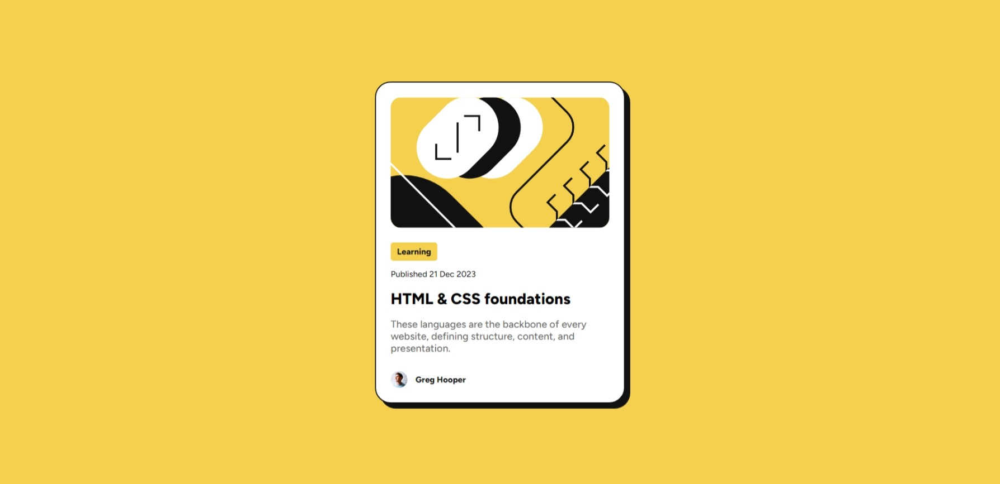

# Frontend Mentor - Blog preview card solution

This is a solution to the [Blog preview card challenge on Frontend Mentor](https://www.frontendmentor.io/challenges/blog-preview-card-ckPaj01IcS). Frontend Mentor challenges help you improve your coding skills by building realistic projects.

## Table of contents

- [Overview](#overview)
  - [The challenge](#the-challenge)
  - [Screenshot](#screenshot)
  - [Links](#links)
- [My process](#my-process)
  - [Built with](#built-with)
  - [What I learned](#what-i-learned)
  - [Continued development](#continued-development)
  - [Useful resources](#useful-resources)
- [Author](#author)
- [Acknowledgments](#acknowledgments)

## Overview

The challenge was to recreate a page to display various social links from scratch. I was given three screenshots of the final page: one mobile, one desktop and one showing the hover state. I was supplied the color pallete and fonts.

### The challenge

Users should be able to:

- See hover and focus states for all interactive elements on the page

### Screenshot

### Links

- Solution URL: [Solution on GitHub](https://github.com/horoserp/blog-card)
- Live Site URL: [Solution on Live Site](https://horoserp.github.io/blog-card)

## My process

I started this challenge by creating the HTML. Then I tackled the CSS systematically from top down. The last step was deployment to GitHub Pages.

### Built with

- Semantic HTML5 markup
- Flexbox
- [React](https://reactjs.org/) - JS library

### What I learned

This project gave me further practice in the use of CSS Flexbox designs. I took this opportunity to gain my practice using React and CSS.

### Continued development

I would like to continue to focus on efficient CSS and thorough Accessibility.

### Useful resources

- [W3Schools](https://www.w3schools.com/) - This is a great reference site which helped me remember some of the required syntax and generalities surrounding the base of a react project.
- [Stack Overflow](https://stackoverflow.com/) - This is an excellent resource for finding answers to precise questions. I used it once or twice during this challenge.

## Author

- Website - [Robert P. Horosewski](https://horoserp.github.io/React-Portfolio)
- Frontend Mentor - [@horoserp](https://www.frontendmentor.io/profile/horoserp)
- LinkedIn - [Robert P. Horosewski](https://www.linkedin.com/in/robert-horosewski-8a0608196/)

## Acknowledgments

Thanks to my wife for the encouragement to pursue my dream.
